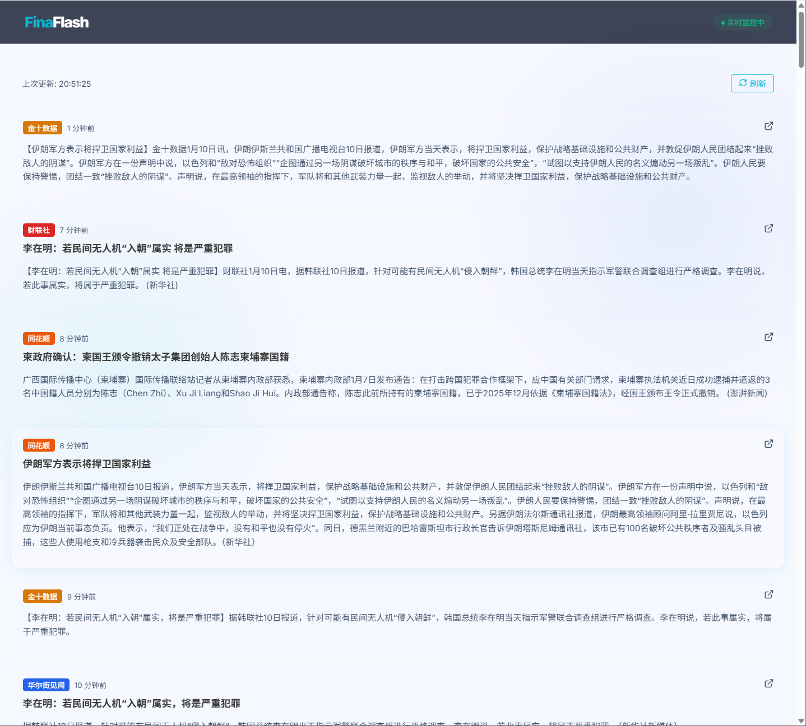

# Fina - 实时财经新闻聚合器 (Financial News Aggregator)

[](https://github.com/mefengl/made-by-ai)


Fina 是一个强大且直观的实时财经新闻聚合平台。它无缝整合了来自中国领先财经平台的快讯内容，旨在为用户提供一个统一、高效、且无干扰的财经信息获取体验。



## 🌟 核心特性

- **多源聚合**: 整合来自 **财联社 (CLS)**、**华尔街见闻 (WSCN)**、**金十数据 (Jin10)** 和 **同花顺 (Ths)** 的实时新闻流。
- **实时更新**: 基于高效的 API 轮询机制，确保您在第一时间掌握市场动向。
- **现代化 UI**: 采用 Next.js 15+ 构建，提供丝滑的响应式体验，支持自适应暗色/亮色模式。
- **自动部署**: 连接 GitHub 与 Vercel 后，分支和 Pull Request 自动生成预览，`main` 自动发布生产版本。

## 🛠️ 技术栈

- **框架**: [Next.js](https://nextjs.org/) (App Router)
- **语言**: [TypeScript](https://www.typescriptlang.org/)
- **样式**: CSS Modules + Vanilla CSS
- **部署**: GitHub + Vercel

## 🚀 快速开始

### 1. 环境准备

确保您的本地环境已安装 Node.js 20.9 或更高版本。

### 2. 安装依赖

```bash
npm install
```

### 3. 本地开发

```bash
npm run dev
```
访问 [http://localhost:3000](http://localhost:3000) 即可预览。

### 4. 生产构建

```bash
npm run build
```

## 🌐 GitHub + Vercel 部署

项目保留动态 `/api/news` Route Handler，由 Vercel Functions 在 Node.js 运行时执行，不适合发布到仅支持静态文件的 GitHub Pages。

### 首次连接

1. 登录 Vercel，选择 **Add New → Project**。
2. 导入 GitHub 仓库 `ubbcou/fina`。
3. 保持 Vercel 自动识别的 Next.js 配置：
   - Root Directory：`.`
   - Install Command：`npm install`（或留空）
   - Build Command：`npm run build`（或留空）
   - Output Directory：留空
4. 当前应用不需要生产环境变量，直接点击 **Deploy**。
5. 部署完成后检查首页与 `/api/news`。

### 后续发布

- 推送到普通分支或创建 Pull Request：生成 Preview Deployment。
- 合并或推送到 `main`：发布 Production Deployment。
- 如需自定义域名，在 Vercel 项目的 **Settings → Domains** 中添加。

API 响应在 Vercel CDN 缓存 20 秒，并允许 40 秒 stale-while-revalidate，避免每个浏览器轮询都重复请求全部上游财经接口。

## 📁 项目结构

```text
├── src/
│   ├── app/            # 页面路由与 API
│   ├── lib/api/        # 各财经源数据抓取逻辑 (CLS, Jin10, WSCN, Ths)
│   ├── components/     # UI 组件
│   └── styles/         # 全局及模块样式
└── public/             # 静态资源
```

## 📄 开源协议

本项目采用 MIT 协议。
